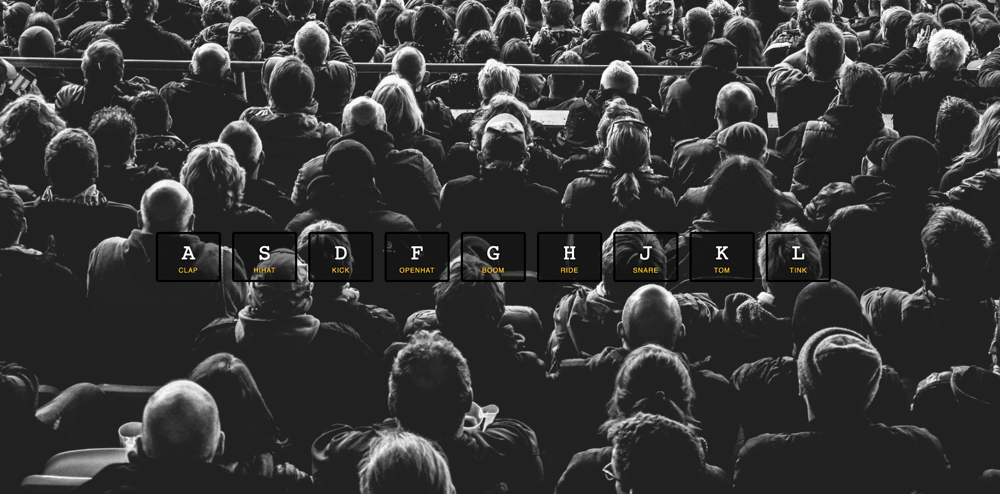

# JavaScript 30 - Drum Kit solution
 

This is a solution to the [Drum Kit challenge on JavaScript 30](https://javascript30.com/). JavaScript 30 is a 30-day Vanilla JS Coding Challenge. 

## Overview

### The challenge

- Build a drum kit website with interactivity and sound.

### Screenshots

- [Desktop](images/desktop-image.png)

### Links

- [Repo](https://github.com/Franciskadtt/drumkit)
- [Live site](https://franciskadtt.github.io/drumkit/)

## My process

### Built with

- HMTL
- CSS 
- Javascript

### What I learned
- Using sounds in a website
- JavaScript functions for sounds, keyboard eventlisteners
- Javascript functions for transitions

## Coded by

- Website - [Franciska Du Toit](https://franciskadutoit.com/)
- Instagram - [@designed.byfranciska
](https://www.instagram.com/designed.byfranciska/)
- LinkedIn - [@franciskadutoit
](https://www.linkedin.com/in/franciskadutoit/)

## Acknowledgements

- All content and images were provided by [JavaScript 30
](https://javascript30.com/)